点击返回[🔗我的博客文章目录](https://2549141519.github.io/#/toc)
* 目录
{:toc}
<div onclick="window.scrollTo({top:0,behavior:'smooth'});" style="background-color:white;position:fixed;bottom:20px;right:40px;padding:10px 10px 5px 10px;cursor:pointer;z-index:10;border-radius:13%;box-shadow:0.5px 3px 7px rgba(0,0,0,0.3);"></div>

# 3TS  
  
# 数据库中执行一致性测试
# 1. PostgreSQL安装
## 1.1 下载 PostgreSQL 15 的源码  
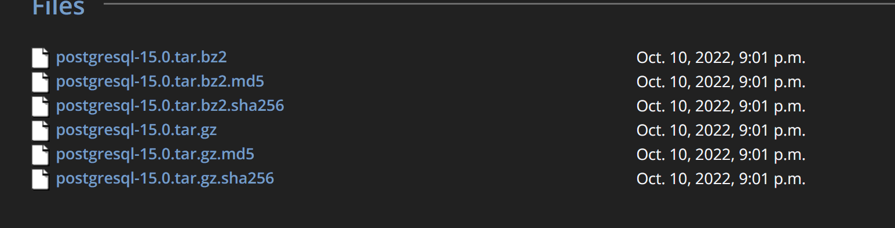  
```
wget https://ftp.postgresql.org/pub/source/v15.0/postgresql-15.0.tar.gz
```  
## 1.2 解压源码包
解压下载的源码包：  
```
tar -xzvf postgresql-15.0.tar.gz
```  
## 1.3 编译并安装 PostgreSQL
进入源码目录，执行以下命令进行编译和安装：  
```
bash
cd postgresql-15.0
./configure
make
sudo make install
```  
## 1.4 创建数据库用户和数据目录
```
sudo mkdir /usr/local/pgsql
sudo mkdir /usr/local/pgsql/data
sudo chown nlove /usr/local/pgsql/data
```  
## 1.5 初始化数据库
初始化数据库:  
```
/usr/local/pgsql/bin/initdb -D /usr/local/pgsql/data
```  
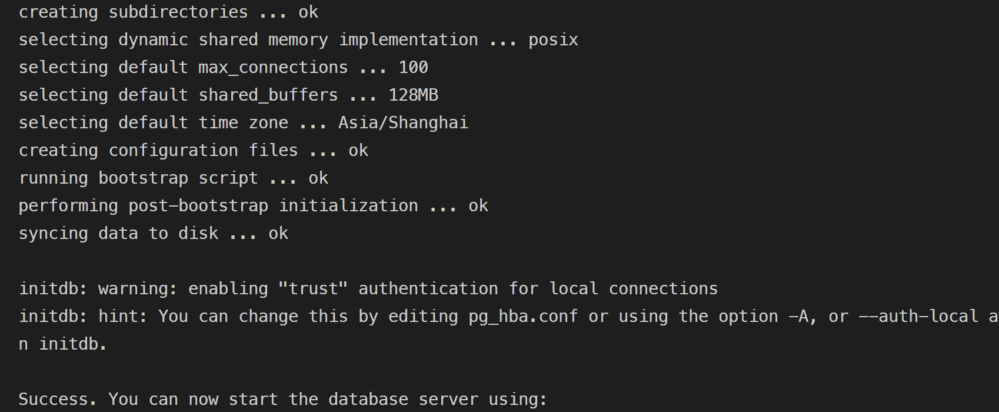  
## 1.6 启动 PostgreSQL 服务
启动 PostgreSQL 数据库服务：  
```
/usr/local/pgsql/bin/pg_ctl -D /usr/local/pgsql/data -l logfile start
```  
  
创建数据库 test：  
```
/usr/local/pgsql/bin/createdb test
```  
创建一个名为 test 的数据库。  
连接到数据库 test：  
```
/usr/local/pgsql/bin/psql test
```  
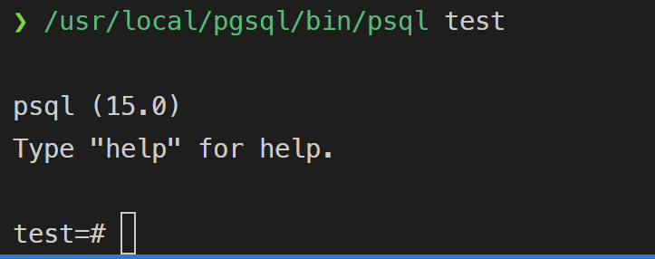   
```
CREATE USER why WITH PASSWORD '123';
ALTER USER why CREATEDB;
```  
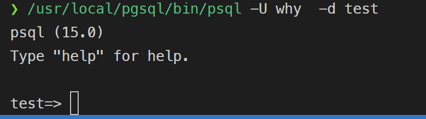  
## 1.7 why用户赋予 CREATE 权限
```
GRANT CREATE ON SCHEMA public TO why;
```  
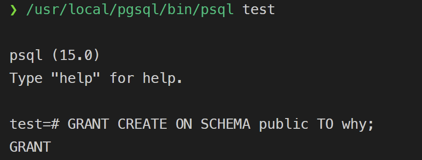  

# 2. 安装 UnixODBC
```
sudo apt-get install unixodbc unixodbc-dev
odbcinst -j
```  
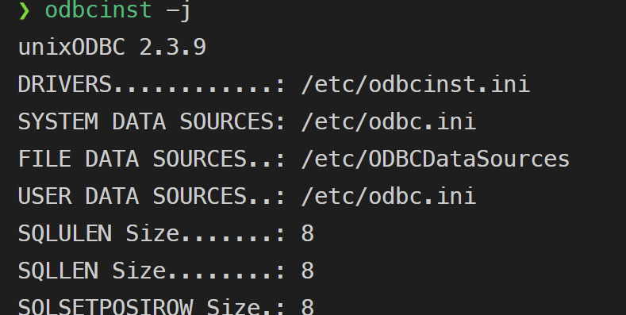  
显示 ODBC 驱动程序和数据源配置文件的位置。  

# 3. 配置 ODBC 数据源
编辑两个配置文件：`/etc/odbcinst.ini` 和 `/etc/odbc.ini`。  
## 3.1 配置 `/etc/odbcinst.ini`
```
sudo nano /etc/odbcinst.ini
插入
[PostgreSQL]
Description = PostgreSQL ODBC Driver
Driver = /usr/lib/x86_64-linux-gnu/odbc/psqlodbcw.so
Setup = /usr/lib/x86_64-linux-gnu/odbc/libodbcpsqlS.so
FileUsage = 1
```  
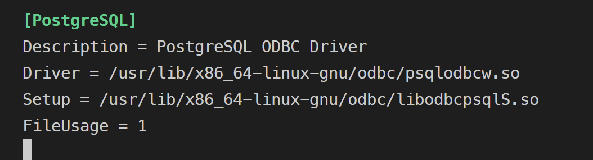  
## 3.2 配置 `/etc/odbc.ini`
这个文件用于配置数据源名称 (DSN)，即指定你将要连接的 PostgreSQL 数据库。  
```
sudo nano /etc/odbc.ini
[pg]
Description = PostgreSQL Database
Driver = PostgreSQL
Servername = localhost
Port = 5432
Database = test
Username = why
Password = 123
```  
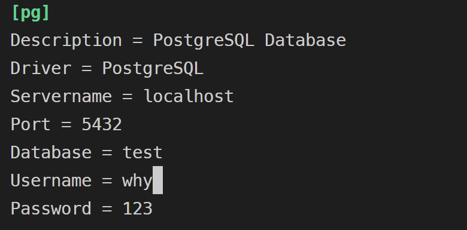  
## 3.3 配置环境变量
确保 ODBCINI 和 ODBCSYSINI 环境变量被正确设置，这可以帮助 isql 工具找到配置文件。  
```
export ODBCSYSINI=/etc
export ODBCINI=/etc/odbc.ini
```  
## 3.4 测试
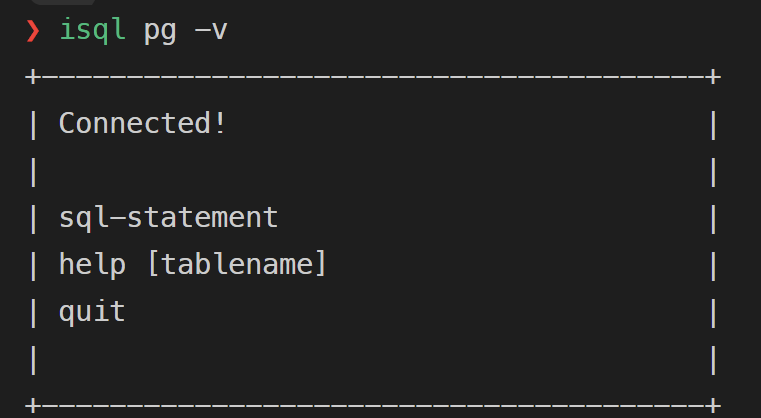  

# 4. 测试一致性  
修改`auto_test.sh`,`user`,`password`。  
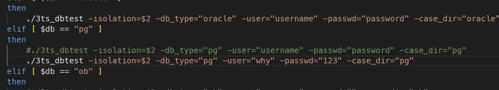  
```
./auto_test.sh "pg" "read-uncommitted"
./auto_test.sh "pg" "read-committed"
./auto_test.sh "pg" "repeatable-read"
./auto_test.sh "pg" "serializable"
```  
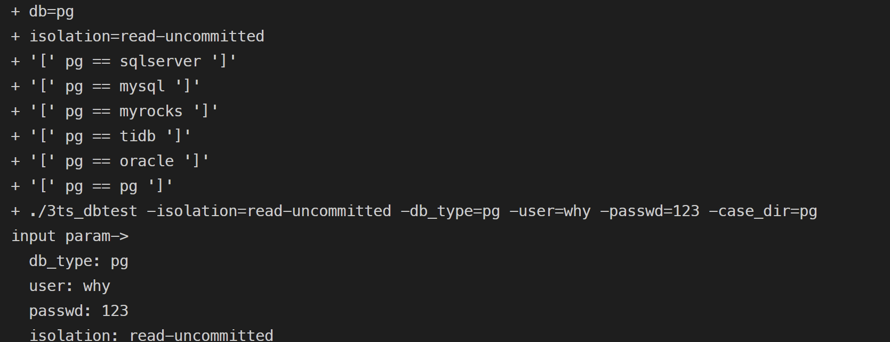  

  

# 5. MYSQL同理
## 5.1 安装好mysql后,需要去官网安装mysql的obdc驱动
[MySQL :: Download MySQL APT Repository](https://dev.mysql.com/downloads/repo/apt/)  
## 5.2 配置obdc数据源
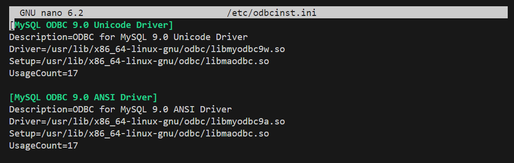  
## 5.3 配置数据源名称
  
## 5.4 运行3ts测试 测试结果如下
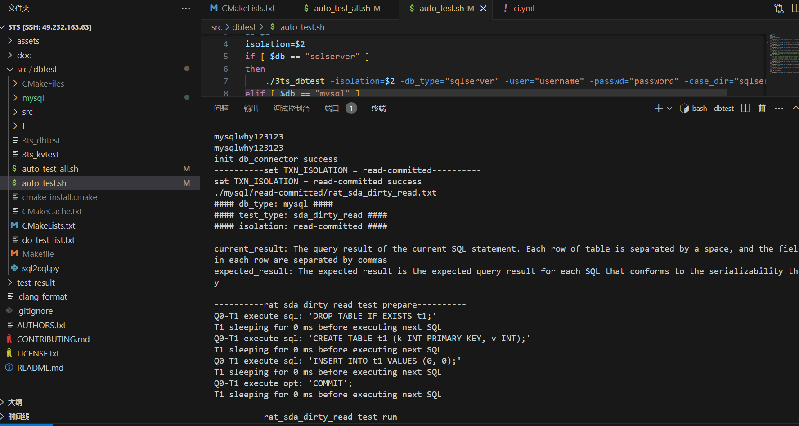  