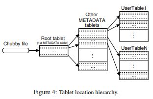

点击返回[🔗我的博客文章目录](https://2549141519.github.io/#/toc)
* 目录
{:toc}
<div onclick="window.scrollTo({top:0,behavior:'smooth'});" style="background-color:white;position:fixed;bottom:20px;right:40px;padding:10px 10px 5px 10px;cursor:pointer;z-index:10;border-radius:13%;box-shadow:0.5px 3px 7px rgba(0,0,0,0.3);"></div>

paper [link](https://storage.googleapis.com/gweb-research2023-media/pubtools/4443.pdf)  
# 1. Bigtable介绍
Google的 Bigtable 是一种分布式存储系统，专门用于管理结构化数据，具有高度的可扩展性。  
在许多方面，Bigtable类似于数据库:它与数据库共享许多实现策略。bigtables不支持完整的关系数据模型，相反，它为客户端提供了一个简单的数据模型，该模型支持对数据布局和格式的动态控制，并允许客户端推断底层存储中表示的数据的局部属性。使用可以是任意字符串的行名和列名对数据进行索引。Bigtable模式参数允许客户端动态控制从内存中还是从磁盘中提供数据。  

# 2. 数据模型
Bigtable是一个稀疏的、分布式的、持久的多维排序映射。映射由行键、列键和时间戳索引，映射中的每个值都是一个未解释的字节数组。  

稀疏的：Bigtable 表格是稀疏的，意味着在表格中不需要为每个行和列都填充数据。只在需要的位置存储数据，这样可以节省存储空间。空白的单元格不会占用资源。  
分布式的：Bigtable 是分布式的，它可以将数据存储在成千上万台服务器上，每个表格会被分割成多个“tablet”（子表），并分布在不同的服务器上。  
持久的：Bigtable 保证数据持久化，即数据被存储后不会丢失，甚至在服务器故障或重启的情况下，数据依然是安全的。这通过底层的 Google 文件系统（GFS）来实现。   
多维排序映射：Bigtable 将数据组织为一个多维的结构，其中数据通过行键、列键和时间戳来定位。这类似于一个三维的哈希表，不同的键为不同维度的数据提供索引。  
行键：行键是表中每一行的唯一标识符。行键按字典序排列，使得 Bigtable 能高效地执行按行范围查询。  
列键：列键用于标识每一行中不同的列数据，列按列族（column family）组织，使得列键具有分组的灵活性。  
时间戳：Bigtable 中的每个单元格（即某一行键和列键交叉的地方）可以存储同一数据的多个版本，每个版本都有一个时间戳。通过时间戳，Bigtable 可以存储历史版本的数据，支持按时间查询。  
未解释的字节数组：映射中的每个值实际上是一个字节数组。Bigtable 不关心这些字节的具体内容，它不提供对数据类型的解释，数据的解析留给应用程序处理。  
三维索引（行键、列键、时间戳）访问数据：  
`(row:string, column:string, time:int64) → string`  

## 2.1 行键
Bigtable的行键是任意字符串。对单行键下数据的每次读取或写入都是原子的。  
按字典顺序维护数据：  
Bigtable 使用 rowkey 来对数据进行排序，并按照字典顺序进行存储。这样，数据行在存储时是按行键（rowkey）的字典序排列的。  
行范围动态分区：  
Bigtable 会动态将表格中的行划分为多个连续的范围，每个范围称为一个“tablet”。这些 tablet 是系统在集群中的分配和负载平衡的最小单位。随着数据的增加或访问负载的变化，系统可以自动调整 tablet 的大小和位置。  
短范围读取的有效性：  
因为数据是按行键的字典顺序存储的，所以当我们查询特定范围的数据时，系统只需要从相关的几个 tablet 中读取数据。这意味着短范围读取（例如按范围查询相邻的行）通常只需要与少量的机器通信。  
利用行键来优化数据访问的局部性：  
客户端可以根据应用的需求来选择合适的行键，以便将相关的数据存储在连续的位置上，这样可以提高数据访问的局部性。例如，在一个 Webtable 中，可以通过倒置 URL 的主机名（如将 `maps.google.com` 变为 `com.google.maps`）来确保同一个域名下的页面（如 `maps.google.com/index.html`）被存储在相邻的行中。  

## 2.2 列键
列族（column families）：  
列族是 Bigtable 数据存储的基本单元，每个列族中包含多个列键。列族是被分组在一起的数据集合，通常是数据类型相似的一组列。  
访问控制：  
Bigtable 在 列族级别 执行访问控制、磁盘和内存使用的管理。这意味着所有数据访问权限、资源管理都在列族级别进行，而不是单个列键级别。  
列族的创建：  
在向某个列族存储数据之前，必须先创建这个列族。一旦列族被创建，用户可以向该列族中添加任意的列键，也就是说列族创建后列键是动态的，不需要预定义。  
列族数量有限：   
虽然列键的数量是无穷大的（可以创建任意数量的列键），但列族的数量应该保持较小，通常在数百个以内。  
限定符（qualifier） :  
限定符是列键的一部分，负责标识具体的列。这可以帮助你在一个列族（column family）内区分多个列键。限定符是灵活的，可以是任意字符串，而列族名必须是可打印的字符。限定符允许同一个列族中存在多种不同类型的列键。  
### 2.2.1 列族设计例子
假设有一个用户数据表，可以设计为：  
`列族A：存储用户的基本信息，比如用户名、年龄（这些信息类型相似，因此被压缩在一起）。`  
`列族B：存储用户的社交信息，比如好友列表、点赞记录（同样类型相似的数据放在一起）。`  
每个列族中的列键（如用户名、年龄、好友列表等）可以是无限的，但这些列键必须在已经创建的列族下添加。  
### 2.2.2 限定符设计例子
假设有一个存储网页数据的表格，列族是 anchor，表示网页上的超链接信息。这个列族可能包含许多不同的链接，每个链接来自不同的网站。这时，可以通过使用不同的限定符来标识这些链接。比如：  
```
列族：anchor
限定符：example.com，google.com，yahoo.com
存储内容：各个链接的锚文本（也就是链接的显示文字）。
更具体地说：
anchor:example.com 存储了来自 example.com 指向当前页面的链接锚文本。
anchor:google.com 存储了来自 google.com 的锚文本
```  

## 2.3 时间戳
多版本存储：  
Bigtable 中的每个单元格可以存储同一数据的多个版本。  
时间戳索引：  
每个数据版本都使用一个 时间戳（timestamp） 作为索引。Bigtable 的时间戳是 64 位的整数，精度可以达到微秒级别。  
自动分配：  
Bigtable 可以自动生成时间戳，代表“实时”时间，单位为微秒。   
手动分配：  
应用程序也可以自己生成并分配时间戳，这样可以更灵活地控制版本。如果应用需要避免多个版本之间的冲突（比如多用户或多线程同时更新同一个单元格），应用程序需要确保生成唯一的时间戳。  
按时间戳降序存储：  
存储的数据版本按时间戳的降序排列，最新版本的数据会首先被读取。这意味着在查询单元格数据时，默认总是先获取最新的版本。  

# 3. 构建模块
Google File System (GFS)：  
Bigtable 使用 GFS 来存储日志和数据文件。GFS 是一个分布式文件系统，专为大规模数据存储设计。Bigtable 将其日志文件和数据文件存储在 GFS 中。  
集群管理系统：  
Bigtable 集群运行在共享机器池中，这些机器同时运行其他分布式应用。Bigtable 依赖一个集群管理系统来调度作业、管理共享资源、处理机器故障，并监控机器的状态。   
SSTable 文件格式：  
Bigtable 内部使用 SSTable 文件格式 来存储数据。SSTable 是一种持久化、不可变的键值映射格式，提供从键到值的持久存储。SSTable 的特点是数据是有序的，不可变的。每个 SSTable 被分为多个块（默认块大小为 64KB），块索引存储在 SSTable 的末尾，并在 SSTable 打开时加载到内存中。通过内存中的索引进行二分查找，可以高效地找到数据块并执行一次磁盘查找来获取数据。    
Chubby 分布式锁服务：  
Chubby 是 Bigtable 依赖的一个高可用、持久的分布式锁服务。Chubby 使用 Paxos 算法来保证多个副本之间的一致性。Chubby 服务通常由五个副本组成，其中一个被选举为主服务器，处理请求。只要多数副本可用并能互相通信，Chubby 服务就能继续运行。  

# 4. 实现
## 4.1 Bigtable 的三个主要组件
客户端库：  
每个客户端都会链接一个库，这个库让客户端可以直接与 Tablet 服务器进行通信，处理读写操作。  
主服务器（Master）：  
主服务器负责管理整个 Bigtable 系统的元数据和协调工作，如 tablet 分配、检测和管理 tablet 服务器的增加或失效、负载均衡、以及在 GFS 上进行垃圾回收等任务。此外，主服务器还处理表结构的更改，比如表或列族的创建。  
Tablet 服务器：  
每个 Tablet 服务器负责管理一定数量的 tablet（通常一个 Tablet 服务器管理 10 到 1000 个 tablet）。它处理对这些 tablet 的读写请求，当某个 tablet 变得过大时，会自动将其分割成较小的 tablet。Tablet 服务器可以根据工作负载的变化动态添加或移除。    
## 4.2 客户端与主服务器的通信
尽管系统采用了单主架构（即只有一个主服务器），但 客户端数据的读写操作并不通过主服务器。相反，客户端直接与 Tablet 服务器通信进行数据操作。客户端在进行读写操作时，也不依赖主服务器获取 tablet 位置信息。    
## 4.3 表和tablet的关系
Bigtable 中的每个集群存储多个表，每个表由多个 tablet 组成。tablet是表中一个特定行范围的数据存储单元。当表格开始时，通常只有一个 tablet，随着数据的增长，系统会自动将其分割成多个 tablet。  
## 4.4 使用类似B+树的三层层级结构存储tablet的位置信息
  
第一层：  
Chubby 文件：Chubby 文件包含了根 tablet 的位置信息。根 tablet 是这棵 “tablet 位置树” 的起点。  
第二层：  
根 tablet：根 tablet 是一个特殊的元数据表中的第一个 tablet，它存储了所有元数据表的 tablet 位置。根 tablet 不会被拆分。  
第三层：   
METADATA 表：每个元数据表（METADATA tablet）存储了一组用户 tablet 的位置信息。这些用户 tablet 是实际存储用户数据的单元。除了存储位置信息外，METADATA 表还存储了关于每个 tablet 的事件日志（如某个服务器何时开始服务某个 tablet）。    
## 4.5 查找tablet位置
客户端缓存：  
客户端会缓存 tablet 的位置信息，以减少重复查询。每当客户端需要访问一个 tablet 时，它首先检查缓存，如果缓存信息无效，客户端会从缓存中向上回溯，依次查找直到找到正确的 tablet 位置。  
网络查询过程：  
如果客户端的缓存是空的，那么整个 tablet 位置查找过程可能需要三次网络查询（包括一次从 Chubby 读取的查询）。如果缓存过时，则可能需要多达六次查询。  
预取优化：  
预取：为了进一步减少网络查询的成本，客户端在读取元数据表时会预取多个 tablet 的位置信息。  
## 4.6 bigtable如何分配tablet
### 4.6.1 tablet分配
每个 tablet 都被分配给一个 tablet 服务器来处理。主服务器负责跟踪所有活跃的 tablet 服务器及其当前分配的 tablet。如果某个 tablet 未分配（unassigned），而有可用的服务器可以容纳这个 tablet，主服务器会向该服务器发送一个请求，要求其加载该 tablet。  
### 4.6.2 Chubby锁机制
Bigtable 使用Chubby来跟踪和管理 tablet 服务器。每当一个 tablet 服务器启动时，它会在 Chubby 中创建一个唯一命名的文件，并获取该文件的独占锁。这个文件用于表明该服务器是活跃的，主服务器通过监控 Chubby 中的目录来发现新的服务器。  
如果某个 tablet 服务器由于网络问题丢失了其 Chubby 会话，它将停止服务 tablet。Chubby 提供了一个有效的机制，允许 tablet 服务器检查其锁是否仍然有效，而不需要频繁进行网络通信。  
### 4.6.3 服务器故障处理
如果一个 tablet 服务器终止服务（例如机器从集群中移除），它会尝试释放 Chubby 锁，以便主服务器能够更快地重新分配该服务器上托管的所有 tablet。  
主服务器通过定期检查 tablet 服务器的锁状态来检测服务器是否已经失效。如果检测到某个服务器已经失去锁或无法联系到该服务器，主服务器会尝试获取该服务器文件的锁。如果成功获取，主服务器将确认该服务器不再服务，并将该服务器的文件删除。然后，主服务器会将该服务器上托管的所有 tablet 标记为“未分配”，以便重新分配。  
### 4.6.4 Master服务器的启动流程
当主服务器启动时，它需要了解当前 tablet 的分配状态，以便在需要时重新分配 tablet。它执行以下步骤： 
```
1. 获取 Chubby 中的独占 master 锁，确保没有其他主服务器同时运行。  
2. 扫描 Chubby 中的服务器目录，找到所有活跃的服务器。  
3. 与每个活跃的 tablet 服务器通信，确认每个服务器已分配的 tablet。  
4. 扫描元数据表（METADATA table）以了解所有的 tablet 列表。若某个 tablet 未分配，则将其标记为未分配，准备重新分配。  
```   
### 4.6.5 Root tablet 和元数据表
扫描元数据表前，主服务器需要确保根 tablet 被分配，因为根 tablet 包含了所有元数据表的名称。若根 tablet 未分配，主服务器将其添加到未分配列表中，以确保其被分配。  
通过扫描根 tablet，主服务器可以了解所有元数据表及其位置。  
### 4.6.6 Tablet 的创建和拆分
一个 table 的 tablet 仅在以下情况改变：  
```
1. 新建或删除表。  
2. 两个 tablet 合并为一个较大的 tablet。  
3. 一个现有的 tablet 拆分为两个较小的 tablet。  
tablet 拆分是由 tablet 服务器发起的，并通过更新元数据表来记录。服务器完成拆分后，会通知主服务器。如果通知丢失（如服务器或主服务器宕机），主服务器会在重新加载该 tablet 时自动检测到拆分并进行相应调整。  
```   
## 4.7 Bigtable 如何存储和管理 tablet 的持久化状态
  
### 4.7.1 持久化状态
Tablet 的持久化状态 是存储在 GFS 中的。Tablet 的更新记录会被提交到 commit log（提交日志）中，这个日志记录了所有的修改（称为 redo 记录），用于在系统崩溃或重启时恢复数据。  
最近提交的更新会被存储在内存中的一个有序缓冲区，称为 memtable。更老的更新会被存储在磁盘上的 SSTable 文件中。  
### 4.7.2 恢复tablet
当 tablet 服务器需要恢复某个 tablet 时，它会从 METADATA 表 中读取该 tablet 的元数据。元数据包含组成该 tablet 的所有 SSTable 文件列表，以及一些 redo 点（指向 commit log 的位置，可能还包含 tablet 的数据）。  
服务器将 SSTable 的索引加载到内存中，并通过应用从 redo 点之后的所有提交日志来重建 memtable。  
### 4.7.3 写操作
当写操作到达 tablet 服务器时，服务器首先检查写入操作是否格式正确，并验证发送者是否有权限执行该操作。权限验证通过读取 Chubby 文件 中的授权列表来完成，通常这个检查是从 Chubby 客户端的缓存中进行的。  
如果写入操作是有效的，数据会被写入 commit log。Bigtable 使用 group commit 技术来提高小量多次修改的吞吐量，减少磁盘写入的开销。  
写入操作被提交后，数据会被插入到内存中的 memtable 中。  
### 4.7.4 读操作
当读操作到达时，服务器同样检查读请求的格式是否正确，并验证发送者是否有权限读取数据。经过验证后，服务器会在 SSTable 和 memtable 的合并视图上执行读取操作。  
因为 SSTable 和 memtable 都是按字典序排序的数据结构，所以合并视图可以高效地构建。  
### 4.7.5 并发性
Tablet 的分裂（split）和合并（merge）操作可以在后台进行，而不会中断读写操作。  
## 4.8 Bigtable的压缩
读写操作在压缩过程中可以继续执行，不会中断操作。  
### 4.8.1 小规模压缩（Minor Compaction）
当 memtable 的大小超过阈值时，它会被冻结，并转换成一个 SSTable 文件，然后写入到 GFS 中。这一过程称为小规模压缩。  
小规模压缩有两个目的：
```
1. 减少内存使用：将 memtable 中的数据持久化到 SSTable，释放 tablet 服务器的内存。  
2. 减少恢复时间：如果服务器崩溃，恢复时需要从日志中读取的内容会减少，因为部分数据已经存储在 SSTable 中，而不需要完全依赖 commit log。   
```  
### 4.8.2 合并压缩（Merging Compaction）
每次小规模压缩都会生成一个新的 SSTable。如果长期不处理，读操作可能需要从多个 SSTable 中合并读取数据，增加查询复杂度。因此，系统会周期性地执行 合并压缩，在后台运行。  
合并压缩 会读取多个 SSTable 的内容，以及 memtable 中的数据，合并它们并写入一个新的 SSTable。合并完成后，旧的 SSTable 和 memtable 可以被丢弃。  
### 4.8.3 全局压缩（Major Compaction）
全局压缩是一种特殊的合并压缩，它将所有的 SSTable 重新写入到一个新的 SSTable 中。全局压缩会清除所有的删除标记和被删除的数据。  
删除标记：在非全局压缩过程中，SSTable 可能包含一些特殊的删除条目，这些条目用来标记哪些数据已经被删除。这些条目会覆盖旧的 SSTable 中仍然存在的数据，确保它们不会被读取。  
全局压缩的作用：    
```
1. 回收删除数据所占用的存储资源。  
2. 确保删除的数据完全从系统中消失，特别是对于存储敏感数据的服务来说，这一点非常重要。  
```  
