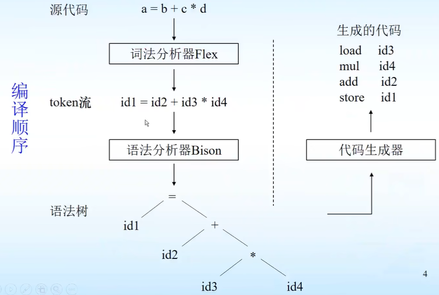
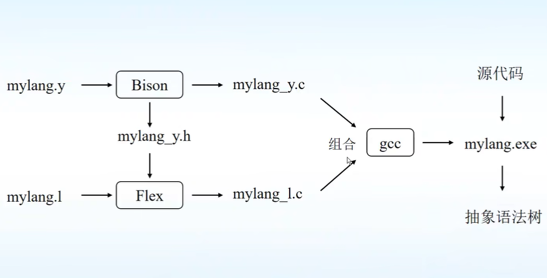
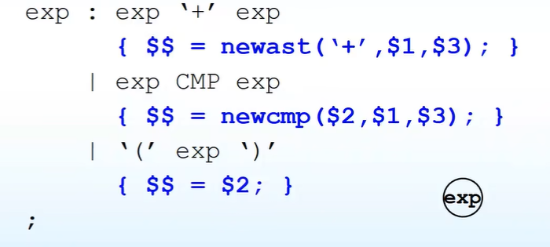
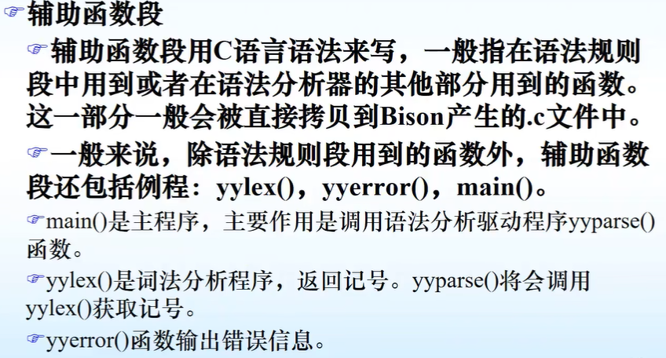

点击返回[🔗我的博客文章目录](https://2549141519.github.io/#/toc)
* 目录
{:toc}
<div onclick="window.scrollTo({top:0,behavior:'smooth'});" style="background-color:white;position:fixed;bottom:20px;right:40px;padding:10px 10px 5px 10px;cursor:pointer;z-index:10;border-radius:13%;box-shadow:0.5px 3px 7px rgba(0,0,0,0.3);"></div>

# 1. Bison简介

Bison是yacc的现代版本，由自由软件基金会的GNU项目帮助发布。  
Bison分为[Linux版本](https://www.gnu.org/software/bison/)和[Windows版本](https://gnuwin32.sourceforge.net/projects/bison.htm/)。  

# 2. Bison工作原理

## 2.1 Bison和Flex协同工作

[Flex](Flex词法分析.md)：词法分析器，将输入分割成一个个有意义的词块，称为记号（token）  
Bison：语法分析器，根据给定的语法规则将Flex生成的tokens转换为抽象语法树（AST）  
编译顺序：  
  
协同工作顺序：  
  

# 3. Bison的输入

Bison的输入为`*.y`文件：  

## 3.1定义段

1. 以c语法写的一些定义和声明，该部分以符号`%{`和`%}`包裹。  
2. 对词法的终结符和非终结符的声明，主要包含：`%token`,`%left`,`%right`,`%nonassoc`,`%union`,`%type`,`%start`。  
`%token`定义语法中使用的终结符。  

`%left`,`%right`,`%nonassoc`也是定义词法中的终结符，但它们定义的终结符具有某种优先级和结合性。  
`%left`表示左结合，`%right`表示右结合，`%nonassoc`表示不可结合。  

`%union`为c语言的联合类型，声明语法分析器中符号值的类型。  
```
%union {
    int num;
    char *str;
}
```  
一旦联合类型被定义，就需要告诉Bison每种符号使用的值类型，通过在尖括号`<>`中的联合类型的相应成员名来确定。  
`%token <num> TOKEN1`  

`%type`定义语法中使用的非终结符。  

`%start`定义语法分析的开始符号，开始符号必须具备一个空规则，为了让开始输入的记号能从起始符号开始匹配。   

## 3.2 语法规则段

  

## 3.3 辅助函数段

  