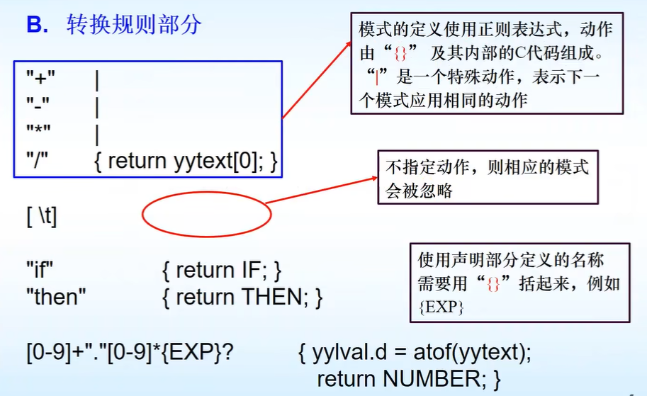

点击返回[🔗我的博客文章目录](https://2549141519.github.io/#/toc)
* 目录
{:toc}

# 1. Flex的使用
.l是Flex源文件，经过Flex编译器，默认生成lex.yy.c文件。  
c编译器默认生成名为a.out的可执行文件。  
输入流经过a.out文件，输出词法单元序列。  
  
## 1.1 Flex源程序的一般形式
三个部分：声明部分、转换规则、辅助函数。三个部分使用`%`分隔。    
声明部分包含名称声明及选项设置，其中`%{`和`%}`之间的内容会被原样复制到生成的c文件开头，通常放一些头文件及注释。  
  
转换规则部分，每个规则由两部分组成：模式和动作，两者由空白分开。词法分析程序识别出某个模式后，执行该模式对应的动作。  
  
辅助函数可以包含任一合法的c代码，这一部分的内容也会被复制到生成的c文件中。  
  
  
  
## 1.2 Flex处理二义性模式
  

