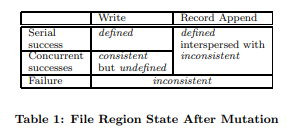
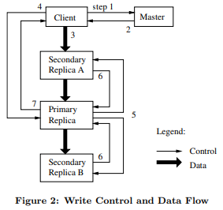

点击返回[🔗我的博客文章目录](https://2549141519.github.io/#/toc)
* 目录
{:toc}
<div onclick="window.scrollTo({top:0,behavior:'smooth'});" style="background-color:white;position:fixed;bottom:20px;right:40px;padding:10px 10px 5px 10px;cursor:pointer;z-index:10;border-radius:13%;box-shadow:0.5px 3px 7px rgba(0,0,0,0.3);"></div>

paper [link](https://static.googleusercontent.com/media/research.google.com/en/us/archive/gfs-sosp2003.pdf)  
# 1. Google File System(GFS)介绍
Google File System (GFS) 是谷歌为应对其大规模数据处理需求而开发的一种分布式文件系统。它的设计目标是高可扩展性和高容错性，能够在大量廉价的硬件设备上运行并提供高性能的数据存储解决方案。GFS 的特点是能够处理分布式数据密集型应用程序，适应如搜索引擎索引、大规模数据处理等需求。  

# 2. 设计

## 2.1 接口
GFS 提供了类似传统文件系统的接口，但没有实现标准的 API（例如 POSIX）。文件以路径名在目录中进行层次化组织，支持常见的文件操作，如创建、删除、打开、关闭、读取和写入。  
除此之外，GFS 提供了两个关键操作：快照（Snapshot） 和 记录追加（Record Append）。  
快照：  
这个功能可以以低成本创建文件或目录树的副本。它特别适合在不占用过多存储资源的情况下，快速保存文件的某个版本或整个目录结构的副本。这对于数据的备份和版本管理非常有用。  
记录追加：  
允许多个客户端同时向同一个文件追加数据，并确保每个客户端的追加操作是原子性的，即不会被其他客户端的操作中断。这种设计非常适合像多路合并结果和生产者-消费者队列等应用场景，多个客户端可以在没有额外锁定机制的情况下，同时追加数据到同一文件。  

## 2.2 架构
GFS架构包括三个核心组件：  
  

### 2.2.1 GFS 客户端
GFS 客户端与应用程序相连，负责处理来自应用程序的文件系统操作请求。  
客户端不直接存储文件数据，而是通过与 GFS Master 和 GFS Chunkserver 的通信来读写数据。  
对于每个请求，客户端会首先联系 Master 来获取文件块的元数据信息（例如，文件名、块位置、块句柄），然后直接与 Chunkserver 进行数据交互。  
客户端会缓存一些元数据，减少与 Master 的交互次数，但不缓存实际文件数据，以避免缓存一致性问题。  

### 2.2.2 GFS Master
GFS Master 是整个文件系统的核心管理组件，负责管理文件系统的元数据（如文件路径、块句柄与位置映射、访问控制等）。  
当客户端发出请求时，Master 会返回块的位置和相应的 Chunkserver 列表，而具体的读写操作则在客户端与 Chunkserver 之间直接进行。
Master 负责控制一些全局活动，比如块的租约管理（确保某个 Chunk 的副本一致性）、孤立块的垃圾回收、以及块在不同 Chunkserver 之间的迁移。  
GFS Master 与每个 Chunkserver 定期通过“心跳”消息进行通信，发送指令并收集 Chunkserver 的状态信息。  

### 2.2.3 GFS Chunkserver
Chunkserver 是负责实际存储文件块的组件，文件被分割成大小固定的块（默认为 64MB），每个块通过 Master 生成的唯一 64 位块句柄进行标识。  
文件块被存储为 Linux 文件，并存储在 Chunkserver 的本地磁盘中。每个文件块默认会有三份副本存储在不同的 Chunkserver 上，以增强容错能力。  
当客户端向 Chunkserver 请求读写数据时，基于块句柄和字节范围，Chunkserver 提供相应的块数据。  
每个文件块有多个副本，系统通过这些副本来处理服务器故障，以确保数据的可靠性。  

## 2.3 单一Master
在GFS中，使用单一 Master 来简化系统的设计，并利用 Master 的全局信息来做出复杂的块（chunk）放置和复制决策。然而，为了避免 Master 成为系统的瓶颈，必须尽量减少其在读写操作中的参与。  

### 2.3.1 读操作流程
初始请求：  
客户端（Client）首先通过文件名和字节偏移（byte offset）将应用程序请求翻译为文件内的块索引（chunk index）。然后客户端向 Master 发送请求，该请求包含文件名和块索引。  
Master 返回信息：  
Master 回复一个块句柄（chunk handle）和块副本所在的服务器地址。客户端将这些信息缓存下来，使用文件名和块索引作为键。  
数据读取：  
客户端选择其中一个副本服务器（通常是最近的一个）发送请求。请求中包含块句柄和要读取的字节范围。随后，客户端直接与 Chunkserver 进行数据交互，而不再通过 Master。  
缓存机制：  
对于同一文件块的后续读取，客户端不再与 Master 进行交互，直到缓存信息过期或者文件被重新打开。此外，客户端通常会在一次请求中查询多个块的元数据，而 Master 也可能返回紧随请求的块信息，这样可以避免未来的多次交互。  

## 2.4 块大小（Chunk Size）
在GFS中，块大小（Chunk Size） 是一个关键的设计参数，GFS 将每个块的大小设为 64 MB，这远大于传统文件系统中的块大小。  

### 2.4.1 大块设计的优势
```
减少客户端与 Master 的交互：
当客户端读取或写入同一个块时，只需要向 Master 发送一次请求以获取块位置信息。特别是对于读取和写入大文件的顺序操作，这种减少交互的好处尤为显著。即使是小范围的随机读取，客户端也能够舒适地缓存整个多 TB 工作集的块位置信息。
减少网络开销：
客户端对大块进行多次操作的几率更高，因此可以保持与 Chunkserver 的持续 TCP 连接，减少了每次操作时重新建立连接的网络开销。
降低元数据的存储压力：
每个文件由较少的块组成，减少了存储在 Master 上的元数据数量。由于元数据减少，Master 能够将所有元数据保存在内存中，从而提高系统的访问速度和性能。
```  

### 2.4.2 大块设计的缺点
```
对于小文件，由于只包含少量的块，可能只有少数几个 Chunkserver 存储了这些块。如果有大量客户端同时访问这些小文件，可能会导致这些 Chunkserver 成为“热点”，承受过多负载。
```  
为了解决这个批处理系统中的热点问题，GFS 采取了以下措施：  
```
增加此类可执行文件的副本数（即增加块的复制因子）。
通过批处理系统的调度，错开应用程序的启动时间，避免同时大量请求。
未来的潜在解决方案包括让客户端在类似情况下从其他客户端读取数据。
```  

## 2.5 元数据
在 GFS 中，Master 存储了三种主要类型的元数据：  
```
文件和块命名空间：
这是文件系统中的路径结构，记录了所有文件和块的层次化结构，即文件名和块名。
文件到块的映射：
这是文件和它们所对应的块之间的映射关系。Master 需要知道每个文件包含哪些块，以便能指导客户端去正确的 Chunkserver 获取数据。
每个块的副本位置信息：
这记录了每个块的副本存储在哪些 Chunkserver 上。
```   
前两类元数据（命名空间和文件到块的映射）是持久化存储的。Master 会将它们的更改（称为“变更”）记录在操作日志中，该日志存储在 Master 的本地磁盘上，并在远程机器上有副本。这种日志记录机制使得 Master 的状态更新简单可靠，即使 Master 崩溃，也能通过日志恢复数据一致性。  
块位置信息并不持久化。Master 在启动时会向每个 Chunkserver 请求其拥有的块信息，当有新的 Chunkserver 加入集群时，也会进行相应更新。  

### 2.5.1 元数据存储在内存中
在 GFS 中，Master 将元数据存储在内存中，这使得 Master 的操作非常快速。由于元数据直接保存在内存中，Master 可以轻松地定期在后台扫描其所有状态数据。这些周期性扫描用于实现一些关键功能，例如：  
垃圾块回收：当某些块不再需要时，Master 可以通过扫描发现这些块并将其删除。  
再复制：如果某个 Chunkserver 发生故障，Master 可以检测到这些块缺失并触发副本的再复制。  
块迁移：为平衡 Chunkserver 之间的负载和磁盘使用率，Master 可以执行块迁移操作。  

### 2.5.2 Chunk位置
在 GFS 中，Master 并不会持久保存每个块的副本位置信息。相反，当 Master 启动时，它通过轮询各个 Chunkserver 来获取这些信息。之后，Master 通过控制块的放置以及定期与 Chunkserver 进行的心跳消息（HeartBeat）保持最新的块位置信息。  

### 2.5.3 操作日志
  
串行成功（Serial Success）：  
```
写操作：当写操作顺序完成时，文件区域的状态是已定义的（defined），即数据被准确写入，结果是确定的。
记录追加操作：当多个客户端进行记录追加操作时，它们的数据可以成功地附加到文件末尾，但不同客户端的数据可能交错在一起。因此，文件区域的状态是部分一致且不一致（inconsistent interspersed），因为数据可能按不确定的顺序混合在一起。
```  
并发成功（Concurrent Success）：  
```
写操作：当多个客户端同时成功写入同一区域时，结果是一致的但未定义的（consistent but undefined）。虽然所有写入的结果是稳定的，但由于没有明确的顺序，文件最终的内容可能不确定。
记录追加操作：在并发追加成功的情况下，文件区域是不一致的（inconsistent），因为可能存在交错的操作。
```  
失败（Failure）：  
```
写操作和记录追加操作在失败的情况下，文件区域会处于不一致的（inconsistent）状态，即数据的写入或追加可能部分完成，导致文件内容不完整或错误。
```  

GFS 的操作日志记录了关键的元数据更改,它不仅是唯一持久化元数据的记录，还通过逻辑时间线来定义并发操作的顺序。Master 在每次更改元数据时会将这些变化记录到操作日志中，并将日志复制到远程机器，如果 Master 崩溃，它会通过重放操作日志来恢复文件系统的状态。  

为了减少启动时间，Master 会在日志文件达到一定大小时，进行检查点（checkpoint）的保存。检查点包含了元数据的当前状态，Master 可以通过加载最新的检查点并重放之后的日志记录来快速恢复状态。  

## 2.6 一致性模型
在GFS中，采用了宽松的一致性模型，这非常适合高度分布式的应用程序。  

### 2.6.1 一致性保证
定义一致性（Defined Consistency）：  
在串行成功的操作中，写入操作和记录追加操作的结果是确定的，即文件区域的内容与期望的写入值一致。  
一致但未定义（Consistent but Undefined）：  
当多个客户端并发地写入同一区域时，GFS 保证最终的文件内容是一致的，但不保证具体的写入顺序，因此文件的最终状态是未定义的。  
不一致（Inconsistent）：  
在写入失败或发生冲突时，文件的某些区域可能处于不一致的状态，即无法确定文件区域的内容。  
命名空间变更的原子性：  
GFS 保证了文件命名空间的变更（例如创建或删除文件）是原子的。由于这些操作都是由 Master 独立处理的，使用了命名空间锁机制确保原子性和正确性。此外，Master 的操作日志定义了全局的操作顺序，使得并发操作有序可控。  
故障处理与副本一致性：  
为了确保一致性，GFS 对每个块的副本按相同的顺序应用变更操作，并通过块的版本号来检测和标记失效副本。如果某个 Chunkserver 在变更时未能及时同步，系统会将其副本标记为过时，确保它不再参与后续的变更操作或提供给客户端读取请求。过时的副本会尽早被垃圾回收。
GFS 通过定期的“心跳”通信检测 Chunkserver 的状态，并使用校验和机制来检测数据损坏。一旦检测到故障，系统会尽快从其他有效副本中恢复数据。  
缓存与过时副本：  
客户端缓存从 Master 获取的块位置信息。虽然客户端可能在缓存过期前读取到过时的副本，但这种情况通过缓存的超时机制和文件重新打开时清除缓存来限制。对于大多数顺序追加的文件，过时副本通常返回的是文件块的提前结束信息，而不是过时的数据。  

### 2.6.2 数据变更类型
GFS 支持两种主要的数据变更操作：写入和记录追加：  
写入操作：  
客户端可以在文件的指定偏移处写入数据，数据在同一偏移处可能被多个客户端并发写入，从而可能产生未定义的区域。  
记录追加操作：  
客户端可以向文件的末尾追加数据，GFS 确保每个追加操作至少成功一次，即使发生并发变更。记录追加操作是原子的，但追加的位置由 GFS 决定，返回给客户端的偏移标记了定义区域的开始。GFS 可能在追加数据之间插入填充或重复记录，这些部分通常被认为是不一致的区域。  

### 2.6.3 对应用的影响
依赖追加而非覆盖：  
大多数 GFS 应用程序通过追加数据来变更文件，而不是覆盖已有数据。  
检查点和校验：  
应用程序会在写入过程中使用检查点（checkpointing）来标记数据的一致状态。检查点可以包含应用程序级别的校验和，帮助读者验证文件的完整性。读者只会处理到最后一个检查点的文件区域，因为该区域是已知的定义状态。  
自验证、自标识的记录：  
对于并发追加数据的情况，例如多个客户端同时向文件中追加数据，应用程序使用记录追加（Record Append）来保证每个写入至少成功一次。这种操作通常用于合并结果或生产者-消费者队列。为了处理由于并发追加产生的填充数据和重复数据，每条记录都包含额外信息（如校验和），帮助读者验证其有效性并识别无效的填充或记录片段。  
`如果重复数据可能导致问题，应用程序可以通过唯一标识符（例如用于标识 Web 文档的 ID）来过滤重复项。`  
高效且恢复能力强：  
这种基于追加和检查点的模型不仅比随机写入更加高效，还能帮助应用程序在失败后增量重启，确保读者不会处理不完整的数据。  

# 3. 系统交互
GFS系统设计时，主要减少了Master对所有操作的参与。  

## 3.1 租约机制和变更顺序
在GFS中，租约机制用于在副本之间保持一致的变更顺序。租约的机制确保所有副本按相同的顺序应用变更（mutation），从而保证数据的一致性。  

  
写操作流程：  
```
1. 客户端请求租约信息：
客户端首先向 Master 询问哪个 Chunkserver 持有该块（chunk）的当前租约（lease），以及其他副本的位置信息。如果当前没有租约，Master 会选择一个副本并授予它租约（不显示在图中）。

2. Master 响应客户端：
Master 向客户端回复持有租约的 Chunkserver（即 Primary 副本）以及其他副本（Secondary 副本）的位置信息。客户端将这些信息缓存，直到 Primary 无法访问或失去租约时，才需要再次联系 Master。

3. 客户端推送数据到所有副本：
客户端将数据推送到所有副本（包括 Primary 和 Secondary）。这可以按任意顺序进行。每个 Chunkserver 会将接收到的数据存储在内部的 LRU 缓存中，直到该数据被使用或逐渐被淘汰。

4. 客户端发送写请求给 Primary：
一旦所有副本确认接收到数据，客户端会向 Primary 发送写请求。此请求标识之前推送的数据。Primary 将为接收到的变更分配连续的序列号，确保变更按顺序应用。

5. Primary 将写请求转发给 Secondary 副本：
Primary 将写请求按照分配的序列号顺序转发给所有 Secondary 副本，确保所有副本以相同的顺序应用变更。

6. Secondary 副本确认操作完成：
Secondary 副本完成变更操作后，向 Primary 确认已完成操作。

7. Primary 向客户端回复：
Primary 在收到所有 Secondary 副本的确认后，向客户端发送确认回复。如果在任何副本上遇到错误，错误会报告给客户端。如果写操作在 Primary 或部分副本上失败，客户端会认为写操作失败，并将受影响的文件区域标记为不一致。客户端代码会重试该变更操作，通常在步骤 3 到 7 之间进行多次重试，如果仍然失败，则从写操作的起始位置重试。
```  

租约机制：  
Master 授予租约给某个副本（Primary），使其负责为该块的变更操作分配顺序。其他副本（Secondary）会按照这个顺序应用变更。  
数据流与控制流分离：   
客户端在将数据推送到副本后，再进行写操作的控制流。这种分离使得系统能够根据网络拓扑结构优化数据传输，而不必依赖 Primary 的位置。  
一致性与未定义状态：  
即使多个客户端同时写入文件，只要所有副本按照相同的顺序完成操作，最终结果将是一致的。不过，由于并发操作，文件可能会包含来自不同客户端的片段，导致该区域的一致性是未定义的。  

## 3.2 数据流
在 GFS 中，数据流（Data Flow） 和 控制流（Control Flow） 是分离的，目的是有效利用网络资源，提高数据传输效率。这种设计的具体目标包括充分利用每台机器的网络带宽、避免网络瓶颈和高延迟链路、以及将数据传输的延迟最小化。  
控制流：  
客户端向 Primary 副本发送控制指令（如写入请求），然后 Primary 将指令按序传递给 Secondary 副本。控制流从客户端流向 Primary，再依次流向所有 Secondary。  

数据流：  
数据以线性的方式沿着选定的 Chunkserver 链条传输。这种方式通过流水线机制进行数据传输，充分利用每台机器的网络带宽，尽量避免网络中的瓶颈和高延迟链路。  

线性数据推送：  
数据不是像树状拓扑那样同时分发到多个节点，而是沿着一条链式拓扑逐个推送。通过这种方式，每个 Chunkserver 的全部出站带宽可以被用于将数据尽快传递到下一个 Chunkserver，而不是分给多个接收方，从而最大化网络带宽的利用。  

避免网络瓶颈：  
为了避免通过网络交换机等高延迟和网络瓶颈，数据按照网络拓扑中“最近”的机器顺序传递。每个 Chunkserver 会将数据转发给它最近的、尚未收到数据的机器，这样能够避免远程链路带来的延迟。  

流水线传输：  
GFS 利用 TCP 连接的流水线机制来降低延迟。一旦某个 Chunkserver 接收到部分数据，它立即开始向下一个 Chunkserver 转发。  

## 3.3 原子记录追加
原子记录追加（Atomic Record Append）是 GFS 中提供的一种特殊操作，用于解决并发写入同一文件时的竞争问题。传统写操作中，客户端会指定数据写入的偏移量，而多个客户端同时写入相同区域可能导致数据混乱和碎片化。而在 Record Append 操作中，客户端只需指定数据，GFS 负责将数据原子性地追加到文件末尾，并选择合适的偏移量返回给客户端。    

### 3.3.1 工作原理
```
1. 数据推送：  
客户端将数据推送到文件最后一个块的所有副本。
2. 写入到 Primary：
客户端发送请求到 Primary 副本。Primary 检查当前块是否有足够的空间容纳新数据。
如果块已接近最大大小（64 MB），Primary 会将块填充到最大大小并通知副本，然后让客户端重试在下一个块上追加数据。
如果数据可以写入，Primary 将数据追加到其副本，并指示 Secondary 副本在相同的偏移位置写入数据，最后向客户端确认成功。
3. 失败处理：
如果写入某个副本时失败，客户端会重试。因此，同一个块的不同副本可能会包含重复的数据或部分记录。GFS 不保证所有副本的字节内容完全一致，但保证数据至少会作为一个原子单位写入一次。
```  
成功的 Record Append 操作后，数据所在的区域被视为已定义的，即一致且可预测的。  
在并发追加中，不同客户端追加的数据可能导致插入的顺序不同，但它们的偏移量和范围是有序的。  

## 3.4 快照（Snapshot）
GFS中，快照操作（Snapshot）用于几乎瞬时地复制文件或目录树，且对正在进行的变更（mutations）产生的中断最小。用户可以使用快照来快速创建数据集的分支副本，或者在进行实验性更改前对当前状态进行检查点保存，之后可以方便地提交更改或回滚。  

### 3.4.1 实现机制
GFS 使用了`写时复制（Copy-on-Write）`技术来实现快照，具体步骤如下：  
```
1. 撤销租约（Lease Revocation）：
当 Master 接收到快照请求时，它首先撤销文件块的现有租约。这确保了任何后续写入操作在访问这些块时必须与 Master 进行交互。这样 Master 可以在写入发生前，首先创建该块的新副本。

2. 日志记录：
租约被撤销或失效后，Master 将快照操作记录到磁盘中，确保其持久性。然后，Master 会在内存中应用该日志记录，通过复制源文件或目录树的元数据来更新状态。

3. 共享块：
新创建的快照文件最初会指向与源文件相同的块。这样，快照操作不会立即创建新的物理数据副本，避免了数据的大量复制，节省了时间和存储资源。

4. 写时复制：
当客户端在快照操作后首次写入某个块时，它会向 Master 发送请求以查找当前的租约持有者。Master 发现该块的引用计数大于 1，即该块同时被多个文件引用。此时，Master 会生成一个新的块句柄，并要求持有原始块副本的 Chunkserver 创建一个新的块副本。新块创建在与原始块相同的 Chunkserver 上，以便数据可以在本地复制而不是通过网络传输。磁盘传输速度比网络快得多，避免了网络带宽的瓶颈。

5. 正常处理：
从此时起，后续的处理就和对普通块的操作没有区别。Master 会将新块的租约授予某个副本，并回复客户端，客户端可以像往常一样写入数据，而无需知道该块实际上是从现有块复制而来的。
```  

### 3.4.2 优势
这种快照机制提供了快速且高效的文件复制方法，特别适合处理大规模数据集，避免了直接复制数据导致的性能问题。  

# 4. Master操作
在 GFS 中，Master 执行所有的命名空间操作，同时负责管理系统中的块（chunk）副本。其主要职责包括以下几方面：  
命名空间操作：  
```
Master 处理所有涉及文件和目录的命名空间操作（如文件创建、删除、重命名等）。它通过管理命名空间元数据来确保文件系统的一致性和正确性。 
```   
块副本管理：  
```
块放置决策：  
Master 决定新的块副本应该放置在哪些 Chunkserver 上。它考虑了负载均衡和数据可靠性等因素，确保副本分布均匀且具备容错能力。
块创建与复制：  
当需要创建新的块或副本时，Master 负责协调 Chunkserver 创建这些块，并确保它们被正确地复制到多个服务器上。
```  
系统协调：  
```
副本保持与复制：
Master 持续监控系统中的块副本数量，确保每个块的副本数目达到预定值。当某个 Chunkserver 失效或副本丢失时，Master 会协调复制更多的副本以确保数据的高可用性。
负载均衡：
Master 监控每个 Chunkserver 的负载情况，努力将负载分配均匀，避免单个服务器过载。
存储回收：
Master 还负责回收未使用的存储资源。例如，当文件或块不再需要时，Master 会安排 Chunkserver 删除这些块以释放存储空间。
```  

## 4.1 命名空间管理和锁机制
在 GFS 中，命名空间管理和锁机制确保了多个并发操作可以安全、高效地执行，特别是在复杂操作（例如快照）执行时不会阻塞其他操作。  
命名空间管理：  
GFS 没有传统文件系统中的每目录数据结构，也不支持硬链接或符号链接。相反，它将命名空间逻辑上表示为一张查找表，将完整路径名映射到文件的元数据。   
为了提高内存效率，GFS 使用前缀压缩来表示这些路径名，以减少内存占用。  
锁机制：  
每个命名空间树的节点（即文件或目录的绝对路径）都与一个读写锁相关联。Master 操作会在执行前获取一组锁，以确保操作的序列化。例如，涉及路径 `/d1/d2/.../dn/leaf` 的操作会获取这些路径上的读锁或写锁，以确保路径和节点的正确访问。  
这种锁机制允许在同一目录中的并发操作。例如，多个文件可以在同一目录下并发创建。每个创建操作只需获取目录名的读锁和文件名的写锁。这可以防止目录被删除、重命名或快照化，但不会阻止文件的创建。  
为防止死锁，锁会按一致的全局顺序获取。锁首先按命名空间树中的层次级别排序，然后在同一层次内按字典序排序。  

### 4.1.1 示例：防止冲突操作
当 `/home/user `目录正在快照到` /save/user `时，另一个操作试图在 `/home/user `下创建文件` /home/user/foo`，锁机制如何防止冲突：  
快照操作会在 `/home` 和 `/save` 目录上获取读锁，并在` /home/user` 和 `/save/user `上获取写锁。  
创建文件操作会在 `/home` 和 `/home/user` 上获取读锁，并在 `/home/user/foo `上获取写锁。  
由于两者都需要在` /home/user` 上获取不同的锁，这两个操作会被正确序列化。  

## 4.2 块创建（chunk creation）、重新复制（re-replication） 和 重新平衡（rebalancing）
在 GFS 中，块副本的创建有三种主要原因：块创建（chunk creation）、重新复制（re-replication） 和 重新平衡（rebalancing）。  

### 4.2.1 块创建（chunk creation）
当 Master 创建一个块时，它会决定副本放置在哪些 Chunkserver 上。以下几个因素会影响副本的放置：  
```
磁盘空间利用率：
Master 会优先选择那些磁盘利用率低于平均水平的 Chunkserver，以平衡整个集群的磁盘利用率。
限制在每个 Chunkserver 上的创建操作数：
虽然创建块本身很便宜，但它往往会预示即将到来的大量写入流量，因为在 GFS 的“写一次，读多次”的工作负载模式下，块一旦写满后，通常会变为只读。因此，Master 会限制每个 Chunkserver 上的块创建数。
跨机架分布：
为了提高容错能力，块副本会分布在不同的机架上，防止单个机架故障时丢失所有副本。
```  

### 4.2.2 重新复制（re-replication）
当块的副本数量低于用户设定的复制目标时，Master 会立即启动重新复制。这可能是因为 Chunkserver 不可用、块副本可能已损坏、磁盘出现错误、或者复制目标增加。重新复制操作的优先级根据以下因素进行排列：  
```
与复制目标的差距：
优先处理那些与复制目标差距较大的块。例如，丢失两个副本的块比只丢失一个副本的块优先级更高。
文件活跃度：
优先重新复制属于活跃文件的块，而不是那些属于已删除文件的块。
阻塞客户端进度的块：
如果某个块的缺失阻碍了客户端的进度，该块的优先级会被提升。
```   
Master 选择最高优先级的块，并指示某个 Chunkserver 从现有的有效副本复制数据，生成新的副本。新副本的放置规则类似于创建块时的标准：平衡磁盘空间利用、限制每个 Chunkserver 上的克隆操作，并将副本分布在不同的机架上。  

### 4.2.3 重新平衡（rebalancing）
Master 会定期检查副本分布，并移动副本以实现更好的磁盘空间和负载均衡。Master 通过这种方式，逐步填充新加入的 Chunkserver，而不是立即向其分配大量块及写入流量。副本重新平衡的标准与副本创建类似，同时 Master 会选择需要删除的现有副本，通常优先删除那些位于磁盘空间较少的 Chunkserver 上的副本，以平衡集群的磁盘使用情况。  

## 4.3 垃圾回收
在 GFS 中，垃圾回收（Garbage Collection）是为了释放文件删除后所占用的物理存储空间，但它不是立即执行的，而是懒惰地进行，在常规的垃圾回收过程中处理。  
垃圾回收过程：  
```
文件级别的回收：
当文件被删除后，文件不会立即从系统中移除，而是先被标记为“已删除”，在之后的垃圾回收过程中真正回收这些文件的存储空间。
块级别的回收：
删除文件时，相关的块数据也不会立刻被移除。垃圾回收会定期检查哪些块不再被引用，并逐步回收它们的存储空间。
```  
延迟回收的好处：  
```
简化系统设计：
垃圾回收不需要与文件删除操作同步进行，减少了对系统的复杂性。
提高可靠性：
通过定期的垃圾回收，系统能够更加稳定地管理和释放存储资源，而不会因频繁的文件删除导致系统不稳定。
```  
垃圾回收的触发时机：  
GFS 定期触发垃圾回收操作，以查找和移除不再使用的块数据。  

### 4.3.1 垃圾回收具体机制
```
文件重命名：
当文件被删除时，Master 会将文件重命名为一个隐藏文件，名称包含删除时间戳。这个文件不会立即被移除，而是保留一定的时间（默认三天，但可以配置）。在此期间，文件仍可以通过其隐藏名称读取，如果需要，可以通过重命名将其恢复。
定期扫描：
Master 定期扫描文件系统的命名空间。如果某个文件的隐藏状态持续超过预定的时间（例如三天），Master 会将该文件从命名空间中移除。这时，文件的元数据会被清除，切断该文件与其块（chunks）的链接。
块的清除：
在对文件命名空间进行扫描的同时，Master 也会扫描块命名空间，查找“孤立的块”（即不再被任何文件引用的块）。这些块的元数据会被 Master 清除。
Chunkserver 回收：
在 Master 与 Chunkserver 之间定期交换的 HeartBeat 消息中，Chunkserver 会报告其持有的块。Master 回复该 Chunkserver，告知哪些块已经不在 Master 的元数据中记录。之后，Chunkserver 可以自由地删除这些块的副本。
```  

### 4.3.2 垃圾回收的简化
引用管理简单：  
所有对块的引用都存储在由 Master 维护的文件到块的映射中。因此，Master 可以轻松识别哪些块不再有引用，并将其标记为孤立块。  
副本管理：  
块的副本在 Chunkserver 上以 Linux 文件的形式存在，任何未被 Master 识别的副本都被视为“垃圾”副本。这些副本可以通过垃圾回收机制定期清理。  

### 4.3.3 垃圾回收简化的优缺点
优点：  
```
简化和可靠性：
垃圾回收避免了在创建或删除副本时需要立即通知所有 Chunkserver 的复杂性。如果在创建块或删除副本的过程中出现失败或通信丢失，Master 仍可以通过后续的垃圾回收机制清理这些残留的副本。
背景批量处理：
垃圾回收与 Master 的其他后台任务（如命名空间扫描和与 Chunkserver 的握手）一起进行，因此在系统负载较轻时进行清理，避免影响前台的客户端请求。
防止误删：
由于垃圾回收有一定的延迟，用户在误删文件时有机会通过恢复隐藏文件重新获取数据，从而提供了一种安全网，避免了不可逆的删除操作。
```  
缺点：  
```
延迟回收影响资源优化：当系统存储空间紧张时，垃圾回收的延迟可能会阻碍用户优化存储使用。例如，应用程序频繁创建和删除临时文件时，可能无法立即重用被删除文件所占的空间。
```  

## 4.4 过时副本检测（Stale Replica Detection）
在 GFS 中，过时副本检测是用来确保 Chunkserver 上的块副本保持最新的一个机制。由于 Chunkserver 可能会因为故障而停止运行，在此期间对块的变更操作（如写入）会使这些副本变得过时。因此，GFS 采用块版本号来区分最新和过时的副本。  
过时副本检测的具体机制：  
```
版本号维护：
每个块都有一个版本号，由 Master 维护。当 Master 授予某个块的新租约时，它会增加该块的版本号，并将新的版本号通知到最新的副本。Master 和这些副本会将新版本号记录在它们的持久化状态中。这些操作发生在客户端写入数据之前，确保客户端始终写入最新的块。
检测过时副本：
如果某个 Chunkserver 在块的变更操作期间不可用，那么该 Chunkserver 的块版本号不会更新。当 Chunkserver 重新启动并向 Master 报告它持有的块和版本号时，Master 会检测到这些块副本的版本号是否过时。如果 Chunkserver 报告的版本号低于 Master 记录的版本号，则该副本被视为过时。相反，如果 Chunkserver 报告的版本号高于 Master 的记录，Master 假定之前授予租约时发生了失败，并将更高的版本号视为最新版本。
移除过时副本：
Master 会在常规的垃圾回收过程中移除这些过时的副本。在此之前，当客户端请求块信息时，Master 会忽略这些过时的副本。此外，当客户端被通知某个块的租约持有者或 Chunkserver 被指示从另一个 Chunkserver 读取块时，Master 会包括块的版本号。客户端或 Chunkserver 会在执行操作时验证版本号，以确保它们始终访问最新的数据。
```  

# 5. 高可用与问题诊断
在 GFS 的设计中，容错性 和 诊断能力 是应对频繁组件故障的关键挑战。  

## 5.1 高可用性策略
快速恢复：  
无论是 Master 还是 Chunkserver，都设计成能在几秒钟内恢复状态并重启。服务器可能会因故障或正常操作被杀死进程，但客户端和其他服务器只会短暂遇到请求超时，然后重新连接到重启后的服务器并重试操作。  
块副本：  
每个块都有多个副本（默认是 3 个），并分布在不同的机架上。这样即使有 Chunkserver 下线或副本损坏，系统也能通过现有的副本保持可用性。Master 通过检查校验和来检测副本的损坏，并在必要时克隆副本以保持所需的副本数量。  
Master 副本：  
Master 的状态和操作日志会被复制到多台机器上。每当有状态变更时，只有在日志被写入到本地磁盘和所有副本机器的磁盘后，才算完成提交。如果 Master 发生故障，监控系统会在其他机器上启动新的 Master 进程，并使用操作日志进行恢复。此外，"影子 Master" 提供只读访问，即使主 Master 不可用，系统仍然可以处理读操作。  

## 5.2 问题诊断
影子 Master：  
影子 Master 提供了对文件系统的只读访问，即使主 Master 停机也不影响读取操作。影子 Master 稍微滞后于主 Master，通常仅有几毫秒的延迟。文件内容通过 Chunkserver 读取，因此应用程序不会遇到过时的文件内容，可能过时的只是文件元数据（如目录内容或访问控制信息）。  
操作日志：  
影子 Master 通过读取操作日志副本，并与主 Master 一样应用相同的变更序列，以保持其数据结构的更新。它依赖主 Master 来获取副本的位置信息更新（如创建和删除副本时的决策）。   

## 5.3 数据完整性
在 GFS 中，数据完整性 是通过 校验和（checksumming） 机制来检测数据损坏的，尤其是在集群规模很大且磁盘故障频繁的情况下。这种方法帮助 GFS 识别并修复由于读写路径中的磁盘损坏而导致的数据损坏。  
### 5.3.1 主要机制  
校验和的使用：  
```
每个块（chunk）会被分成 64 KB 的小块（block），每个小块对应一个 32 位的校验和。这些校验和被单独存储，和用户数据分开保存。
在读取数据时，Chunkserver 会在返回数据之前先验证这些小块的校验和。如果校验和不匹配，Chunkserver 会向请求者返回错误，并向 Master 报告数据损坏。
请求者可以从其他副本读取数据，而 Master 会根据报告情况复制一个新的有效副本，随后删除已损坏的副本。
```  
读操作中的校验和验证：  
```
读取操作时，Chunkserver 会先验证重叠读取范围内的数据块的校验和，确保不会传播已损坏的数据。如果校验和不匹配，Chunkserver 会报错，并启动修复过程。
```  
写操作中的校验和更新：  
```
对于追加操作（append），GFS 会增量更新最后一个部分填充的校验和块，并为新增的块计算校验和。
对于覆盖写入（overwrite），GFS 必须在写入之前先验证要覆盖的块的起始和结束部分，以避免隐藏之前已存在的数据损坏。
```  
空闲时校验：  
```
在空闲时，Chunkserver 会扫描并验证不活跃的块，以检测可能存在的损坏。这确保了即使是很少读取的块，也不会因未检测的损坏影响数据的一致性。
```  
