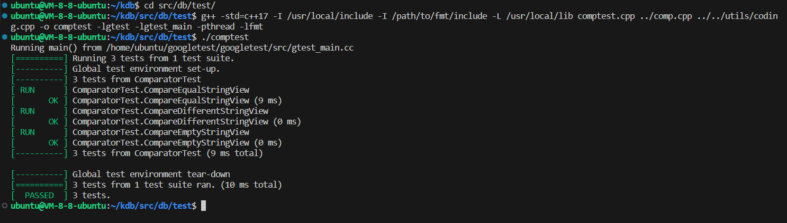

点击返回[🔗我的博客文章目录](https://2549141519.github.io/#/toc)
* 目录
{:toc}
<div onclick="window.scrollTo({top:0,behavior:'smooth'});" style="background-color:white;position:fixed;bottom:20px;right:40px;padding:10px 10px 5px 10px;cursor:pointer;z-index:10;border-radius:13%;box-shadow:0.5px 3px 7px rgba(0,0,0,0.3);"></div>

# 1. 比较器
本文介绍对于kdb中比较器[`Comparator`](https://github.com/2549141519/kdb/src/db/comp.cpp)的单元测试。   

比较器实现逻辑如下：   
```
解析键的长度： 代码首先从 left 和 right 字符串视图中读取键的长度（前面编码成 Varint 的 32 位整数）。通过 GetVarint32Ptr 函数从数据中解析出键的长度，并进行断言检查确保解析成功。

提取键值： 通过从 left_key_len_ptr 和 right_key_len_ptr 解析出的长度，创建两个新的 std::string_view 分别表示 left 和 right 的键值。

比较键值： 如果两个键值不同，直接比较它们的字符串值。std::string_view 支持字典序比较，代码通过 operator< 和 operator> 来进行比较，结果为 -1（left 小于 right）、1（left 大于 right）。

如果键值相等： 当两个键值相等时，代码进一步解析并比较序列号。使用 GetVarint64Ptr 函数从键值之后的位置提取出 64 位序列号，并进行比较。最终返回比较结果。

结果返回： 返回 -1 表示 left 小于 right，1 表示 left 大于 right，0 表示它们完全相同。
```  


# 2. GoogleTest实现
为测试比较器，实现了[`ComparatorTest`](https://github.com/2549141519/kdb/src/db/test/comptest.cpp)。    

为了模拟工作场景，在测试中实现了Set函数，用于将数据编码为sstable内部键的格式。  
```
std::string Set(const std::shared_ptr<SetContext>& set_context) {
  auto key_size = VarintLength(set_context->key.size());
  auto value_size = VarintLength(set_context->value.size());
  auto sequence_number = VarintLength(set_context->value.size());

  std::string simple_set_str = fmt::format(
      "{}{}{}{}{}{}", format32_vec[key_size], set_context->key,
      format64_vec[sequence_number], kEmpty1Space,
      format32_vec[value_size], set_context->value);

  char* start_ptr = simple_set_str.data();
  start_ptr = EncodeVarint32(start_ptr, set_context->key.size());

  start_ptr += set_context->key.size();
  start_ptr = EncodeVarint64(start_ptr, set_context->number);

  EncodeFixed8(start_ptr,ValueType::kTypeValue);

  start_ptr += 1;
  EncodeVarint32(start_ptr, set_context->value.size());

  return simple_set_str;
}
```  

实现了三个测试用例：  
1. 测试两个相同的键值：  
```
TEST_F(ComparatorTest, CompareEqualStringView) {
    SetContext context1(std::string_view("key1"), std::string_view("key"));
    context1.number = 1;
    SetContext context2(std::string_view("key2"), std::string_view("key"));
    context2.number = 2;

    std::string_view testcontext1 = Set(std::make_shared<SetContext>(context1));
    std::string_view testcontext2 = Set(std::make_shared<SetContext>(context2));

    EXPECT_EQ(-1,cmp(testcontext1, testcontext2));  // session1 < session2，
    EXPECT_EQ(1,cmp(testcontext2, testcontext1)); // session2 > session1，
}
```  

在键值相同时，比较序列号大小。  

2. 测试两个不同的键值：  
```
TEST_F(ComparatorTest, CompareDifferentStringView) {
    SetContext context1(std::string_view("key1"), std::string_view("key1"));
    SetContext context2(std::string_view("key2"), std::string_view("key2"));
    
    std::string_view testcontext1 = Set(std::make_shared<SetContext>(context1));
    std::string_view testcontext2 = Set(std::make_shared<SetContext>(context2));

    EXPECT_EQ(-1,cmp(testcontext1, testcontext2)); 
    EXPECT_EQ(1,cmp(testcontext2, testcontext1)); 
}
```  

3. 测试空的键值：  
```
TEST_F(ComparatorTest, CompareEmptyStringView) {
    SetContext context1(std::string_view("key1"), std::string_view(""));
    SetContext context2(std::string_view("key2"), std::string_view("key"));

    std::string_view testcontext1 = Set(std::make_shared<SetContext>(context1));
    std::string_view testcontext2 = Set(std::make_shared<SetContext>(context2));

    EXPECT_EQ(-1,cmp(testcontext1, testcontext2)); 
    EXPECT_EQ(1,cmp(testcontext2, testcontext1)); 
}
```  
测试命令：  
`g++ -std=c++17 -I /usr/local/include -I /path/to/fmt/include -L /usr/local/lib comptest.cpp ../comp.cpp ../../utils/coding.cpp -o comptest -lgtest -lgtest_main -pthread -lfmt`   
执行命令后生成comptest文件，执行./comptest即可。   

测试结果如下：  
