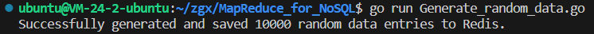
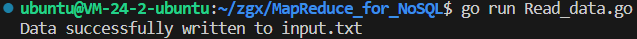
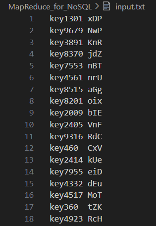
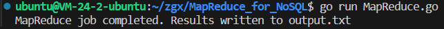
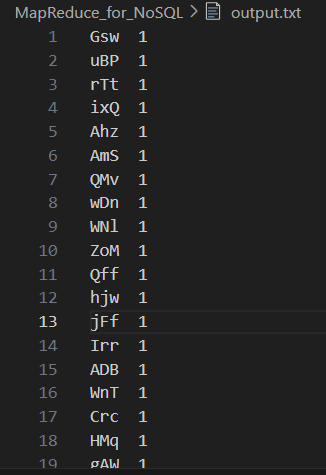

点击返回[🔗我的博客文章目录](https://2549141519.github.io/#/toc)
* 目录
{:toc}

# 1. 前言
本文将实现MapReduce和NoSQL数据库的交互，统计单词出现次数。
NoSQL数据库选用redis6.0，以下是redis操作的一些命令(我设置的redis6.0端口为6380)：
>sudo redis-server /etc/redis/redis.conf  
//启动redis6.0实例  
redis-cli -p 6380  
//连接redis6.0实例,6380为端口号  
redis-cli -p 6380 KEYS "key*" | xargs redis-cli -p 6380 DEL  
//删除redis6.0实例中以key*为前缀的所有key  

# 2. 使用go语言实现
## 2.1 生成随机数据并存入Redis
随机生成1万个单词，并写入redis数据库中：
>package main  
import (  
	"context"  
	"fmt"  
	"math/rand"  
	"time"  
	"github.com/go-redis/redis/v8"  
)  
// 生成随机字符串  
func randomString(n int) string {  
	letters := []rune("abcdefghijklmnopqrstuvwxyzABCDEFGHIJKLMNOPQRSTUVWXYZ")  
	s := make([]rune, n)  
	for i := range s {  
		s[i] = letters[rand.Intn(len(letters))]  
	}  
	return string(s)  
}  
// 生成随机数据并存入Redis  
func generateDataAndSaveToRedis(rdb *redis.Client, count int) {  
	ctx := context.Background()  
	for i := 0; i < count; i++ {  
		key := fmt.Sprintf("key%d", i)  
		value := randomString(3) // 生成长度为3的随机字符串  
		err := rdb.Set(ctx, key, value, 0).Err()  
		if err != nil {  
			panic(err)  
		}  
	}  
	fmt.Printf("Successfully generated and saved %d random data entries to Redis.\n", count)  
}  
func main() {  
	// 设置随机种子  
	rand.Seed(time.Now().UnixNano())  
	// 连接到Redis  
	rdb := redis.NewClient(&redis.Options{  
		Addr: "localhost:6380", // Redis服务器地址  
		DB:   0,                // 使用默认的DB  
	})  
	// 生成10000个随机数据并存入Redis  
	generateDataAndSaveToRedis(rdb, 10000)  
}  

执行命令：go run Generate_random_data.go  
  

## 2.2 读取Redis数据到文件
读取Redis数据到文件：
>package main  
import (  
	"bufio"  
	"context"  
	"fmt"  
	"os"  
	"github.com/go-redis/redis/v8"  
)  
// 从Redis中读取所有数据  
func fetchDataFromRedis(rdb *redis.Client) map[string]string {  
	ctx := context.Background()  
	keys, err := rdb.Keys(ctx, "*").Result()  
	if err != nil {  
		panic(err)  
	}  
	data := make(map[string]string)  
	for _, key := range keys {  
		value, err := rdb.Get(ctx, key).Result()  
		if err != nil {  
			panic(err)  
		}  
		data[key] = value  
	}  
	return data  
}  
// 将数据写入到文件  
func writeDataToFile(data map[string]string, filename string) {  
	file, err := os.Create(filename)  
	if err != nil {  
		panic(err)  
	}  
	defer file.Close()  
	writer := bufio.NewWriter(file)  
	for key, value := range data {  
		fmt.Fprintf(writer, "%s\t%s\n", key, value)  
	}  
	writer.Flush()  
	fmt.Printf("Data successfully written to %s\n", filename)  
}  
func main() {  
	// 连接到Redis  
	rdb := redis.NewClient(&redis.Options{  
		Addr: "localhost:6380", // Redis服务器地址  
		DB:   0,                // 使用默认的DB  
	})  
	// 从Redis中读取数据  
	data := fetchDataFromRedis(rdb)  
	// 将数据写入到文件作为MapReduce输入  
	writeDataToFile(data, "input.txt")  
}  

执行命令：go run Read_data.go  
  

此时input.txt文件内容如下：  
  

## 2.3 MapReduce实现
MapReduce实现：
>package main  
import (  
	"bufio"  
	"fmt"  
	"os"  
	"strings"  
)  
// Map函数将读取输入文件，并输出每个单词的键值对（word, 1）  
func mapFunction(filename string) map[string]int {  
	file, err := os.Open(filename)  
	if err != nil {  
		panic(err)  
	}  
	defer file.Close()  
	wordCount := make(map[string]int)  
	scanner := bufio.NewScanner(file)  
	for scanner.Scan() {  
		line := scanner.Text()  
		// 假设输入文件每行的格式是 "key\tvalue"  
		parts := strings.Split(line, "\t")  
		if len(parts) != 2 {  
			continue // 跳过格式不正确的行  
		}  
		value := parts[1]  
		words := strings.Fields(value)  
		for _, word := range words {  
			wordCount[word] += 1  
		}  
	}  
	if err := scanner.Err(); err != nil {  
		panic(err)  
	}  
	return wordCount  
}  
// Reduce函数将汇总Map函数的输出，计算每个单词的总次数  
func reduceFunction(mappedData map[string]int) map[string]int {  
	reducedData := make(map[string]int)  
	for word, count := range mappedData {  
		reducedData[word] += count  
	}  
	return reducedData  
}  
// 将结果写入到文件中  
func writeResultToFile(result map[string]int, outputFilename string) {  
	file, err := os.Create(outputFilename)  
	if err != nil {  
		panic(err)  
	}  
	defer file.Close()  
	writer := bufio.NewWriter(file)  
	for word, count := range result {  
		fmt.Fprintf(writer, "%s  %d\n", word, count)  
	}  
	writer.Flush()  
}  
func main() {  
	// Map阶段  
	mappedData := mapFunction("input.txt")  
	// Reduce阶段  
	reducedData := reduceFunction(mappedData)  
	// 输出结果到文件  
	writeResultToFile(reducedData, "output.txt")  
	fmt.Println("MapReduce job completed. Results written to output.txt")  
}  

执行命令：go run MapReduce.go  
  

output.txt文件内容如下：  
  
