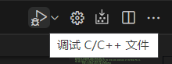
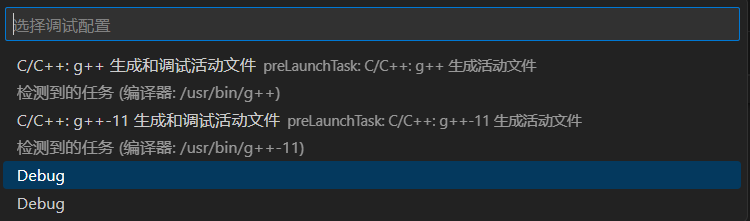
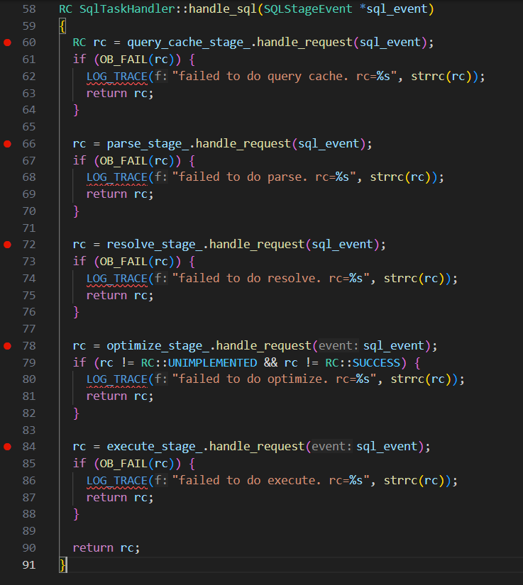
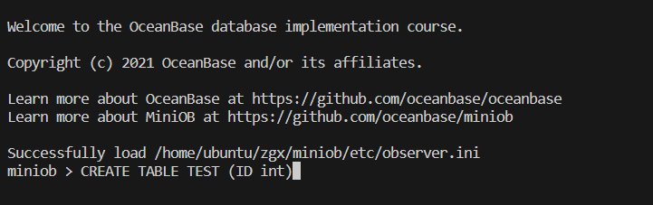
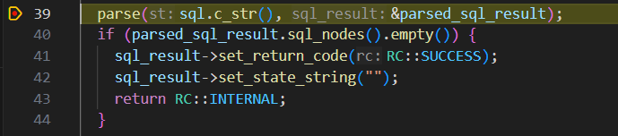
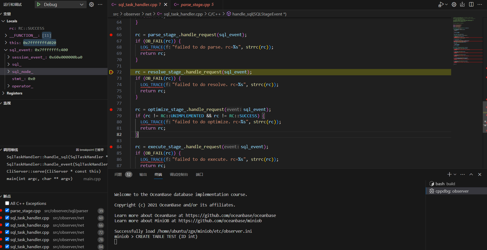
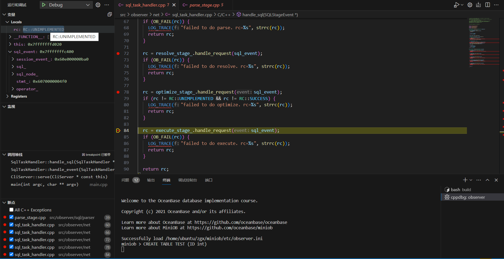
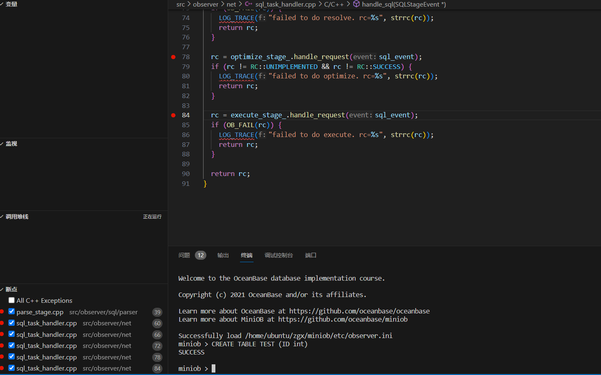
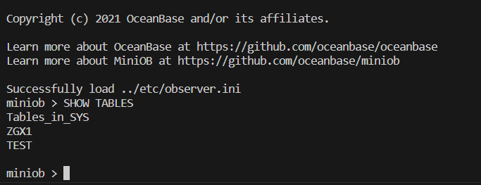

点击返回[🔗我的博客文章目录](https://2549141519.github.io/#/toc)
* 目录
{:toc}
<div onclick="window.scrollTo({top:0,behavior:'smooth'});" style="background-color:white;position:fixed;bottom:20px;right:40px;padding:10px 10px 5px 10px;cursor:pointer;z-index:10;border-radius:13%;box-shadow:0.5px 3px 7px rgba(0,0,0,0.3);"></div>

# 1. 使用miniob的DEBUG
miniob已经实现了`launch.json`和`tasks.json`，可以直接调试。  
在`miniob/src/observer/net/sql_task_handler.cpp`中，直接找到`handle_sql`函数，打断点，调试即可。  
  
  

```
RC SqlTaskHandler::handle_sql(SQLStageEvent *sql_event)
{
  RC rc = query_cache_stage_.handle_request(sql_event);
  if (OB_FAIL(rc)) {
    LOG_TRACE("failed to do query cache. rc=%s", strrc(rc));
    return rc;
  }

  rc = parse_stage_.handle_request(sql_event);
  if (OB_FAIL(rc)) {
    LOG_TRACE("failed to do parse. rc=%s", strrc(rc));
    return rc;
  }

  rc = resolve_stage_.handle_request(sql_event);
  if (OB_FAIL(rc)) {
    LOG_TRACE("failed to do resolve. rc=%s", strrc(rc));
    return rc;
  }

  rc = optimize_stage_.handle_request(sql_event);
  if (rc != RC::UNIMPLEMENTED && rc != RC::SUCCESS) {
    LOG_TRACE("failed to do optimize. rc=%s", strrc(rc));
    return rc;
  }

  rc = execute_stage_.handle_request(sql_event);
  if (OB_FAIL(rc)) {
    LOG_TRACE("failed to do execute. rc=%s", strrc(rc));
    return rc;
  }

  return rc;
}
```  

# 2. 调试
打断点：  
  
开始调试：  
键入`CREATE TABLE TEST (ID int)`,创建一个名为“TEST”的表,表含一个名为“ID”的整型字段。    
  
解析阶段：  
  
解析完成后，生成语法树SQLNode：  
  
`CREATE TABLE`操作没有优化计划，返回`UNIMPLEMENTED`，直接进入执行阶段。  
  
进入执行器执行，输出SUCCESS。  
  
编译结束后执行`SHOW TABLES`命令查看所有表，确保成功创建表：  
