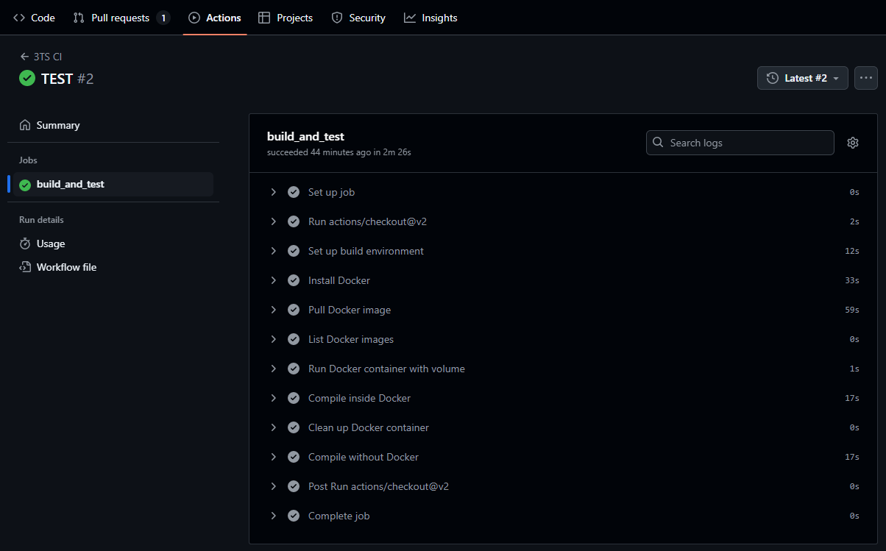
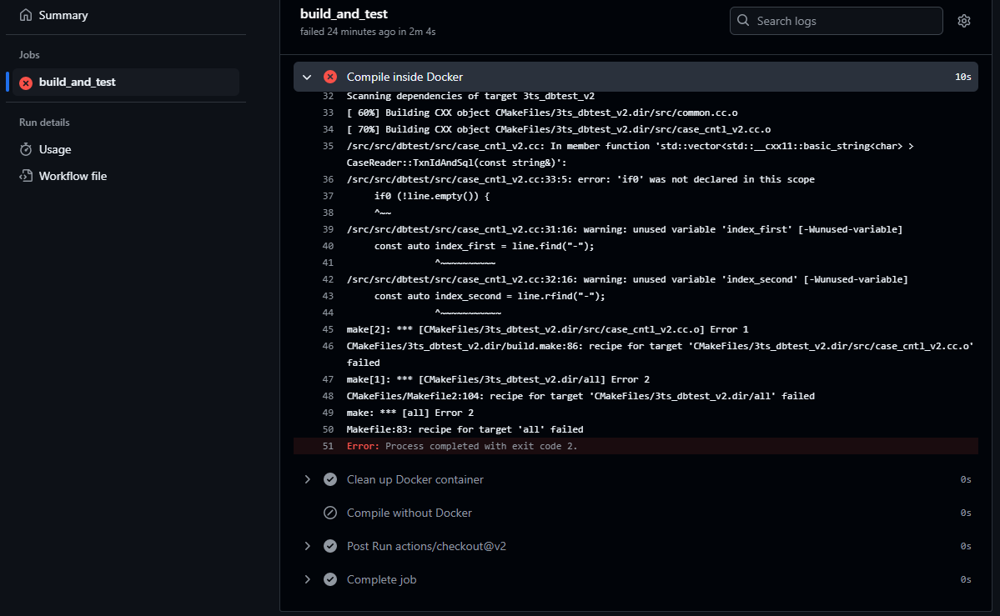

点击返回[🔗我的博客文章目录](https://2549141519.github.io/#/toc)
* 目录
{:toc}
<div onclick="window.scrollTo({top:0,behavior:'smooth'});" style="background-color:white;position:fixed;bottom:20px;right:40px;padding:10px 10px 5px 10px;cursor:pointer;z-index:10;border-radius:13%;box-shadow:0.5px 3px 7px rgba(0,0,0,0.3);"></div>

# 1. GitHub Actions的工作流文件
.github/workflows 文件夹中的每个文件都是一个工作流（workflow），通常以.yml或.yaml结尾。  
每个工作流文件定义了一组自动化任务，这些任务会在特定事件发生时（如代码推送、PR创建、计划任务等）触发执行。  
工作流的组成：  
>
name: 工作流的名称，用于标识这个工作流。  
on: 触发工作流的事件（如push、pull_request、schedule等）。  
jobs: 一组任务，每个任务可以在不同的虚拟机环境中运行。任务可以包含多个步骤（steps），每个步骤是一个具体的Shell命令或GitHub Action。  
steps: 每个job下的具体步骤，用于执行脚本、运行命令、调用外部的GitHub Action等。  

# 2. workflows集成测试实现
要求集成测试能测试项目是否成功编译。  
在3TS中，有两种编译方式：
>
1. 直接编译安装，在`3TS/src/dbtest`目录下执行  
```cmake -S ./```  
```make```  
2. 使用docker编译，执行以下命令安装docker（如果还未安装docker）  
```curl -s https://get.docker.com/ | sh```  
获取镜像  
```docker pull registry.cn-hangzhou.aliyuncs.com/open_projects/3ts_coo:1.0```  
查看镜像ID，并根据镜像ID生成容器  
```docker images```  
```docker run -it [image_id] /bin/bash```  
查看所有容器，进入容器  
```docker ps -a```  
```docker exec -it [container_id] /bin/bash```  

## 2.1 集成测试实现
在项目根目录下，进入`.github/workflows`文件夹，新建`ci.yml`文件，添加如下内容：  
```
name: 3TS CI

on:
  push:
    branches:
      - coo-consistency-check
  pull_request:
    branches:
      - coo-consistency-check

jobs:
  build_and_test:
    runs-on: ubuntu-latest

    steps:
    - uses: actions/checkout@v2

    # 设置构建环境和安装依赖项
    - name: Set up build environment
      run: |
        echo "Setting up build environment..."
        sudo apt-get update && sudo apt-get install -y cmake make g++ libgflags-dev unixodbc unixodbc-dev odbcinst odbcinst1debian2
        echo "Build environment setup complete."

    # 安装 Docker，如果尚未安装
    - name: Install Docker
      run: |
        echo "Installing Docker..."
        curl -s https://get.docker.com/ | sh
        echo "Docker installed successfully."

    # 拉取 Docker 镜像
    - name: Pull Docker image
      run: docker pull registry.cn-hangzhou.aliyuncs.com/open_projects/3ts_coo:1.0

    # 列出 Docker 镜像
    - name: List Docker images
      run: docker images

    # 运行 Docker 容器，并挂载项目目录
    - name: Run Docker container with volume
      run: |
        IMAGE_ID=$(docker images -q registry.cn-hangzhou.aliyuncs.com/open_projects/3ts_coo:1.0)
        docker run -d --name 3ts_container -v ${{ github.workspace }}:/src $IMAGE_ID tail -f /dev/null

    # 在 Docker 容器中编译
    - name: Compile inside Docker
      run: |
        echo "Compiling in Docker container..."
        docker exec -i 3ts_container bash -c "cd /src/src/dbtest && cmake -S ./ && make"

    # 清理 Docker 容器
    - name: Clean up Docker container
      if: always()
      run: docker rm -f 3ts_container

    # 在非 Docker 环境编译
    - name: Compile without Docker
      run: |
        echo "Compiling using CMake..."
        cd src/dbtest
        sudo rm -rf CMakeCache.txt CMakeFiles  # 清除缓存文件
        cmake -S ./ || cmake -DCMAKE_PREFIX_PATH=/usr/ -S ./
        make
        echo "Compilation finished."

```  
提交代码到`coo-consistency-check`分支，GitHub Actions就会自动触发工作流，并执行测试。申请pull request，审核通过也可以触发工作流。  
测试通过，说明项目可以成功编译。  

# 3. 集成测试结果
编译成功的测试结果如下：  
  

此时若修改代码使编译不通过，测试结果如下：  
  